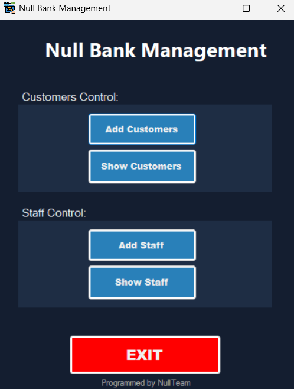
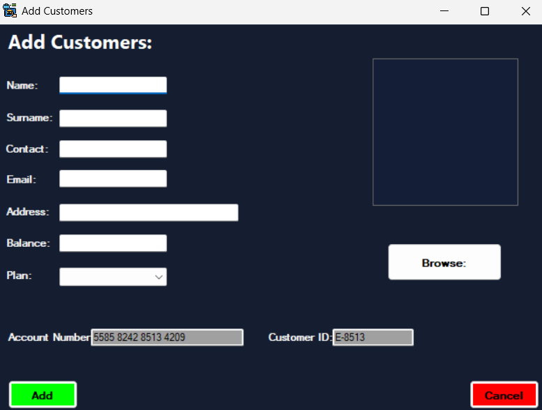
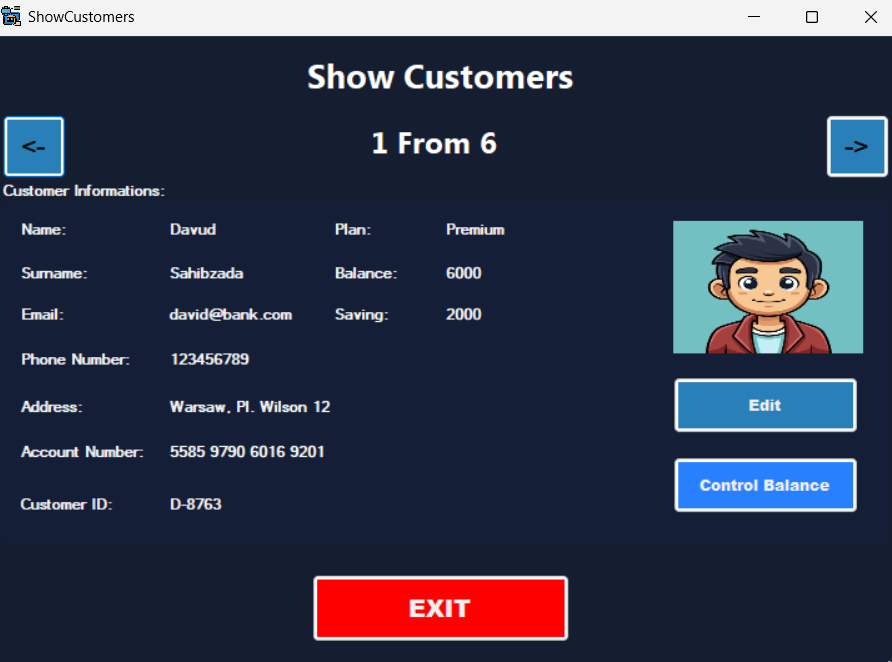
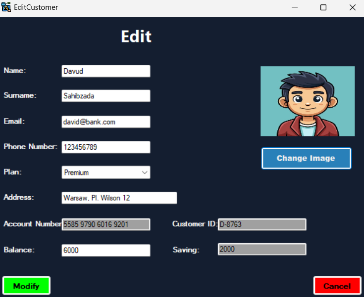
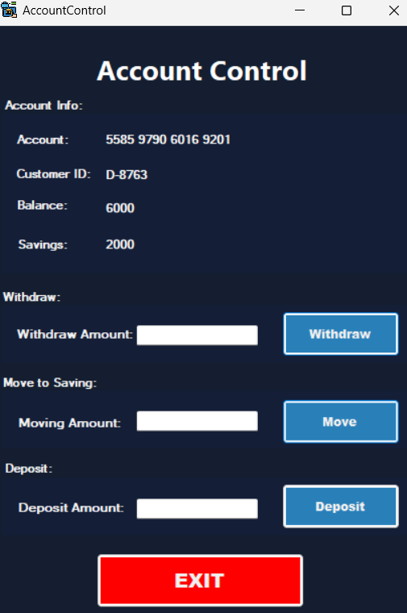
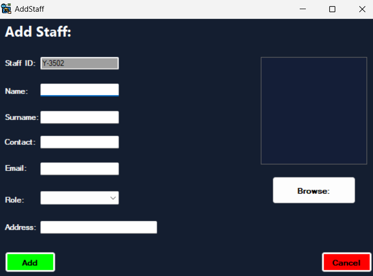
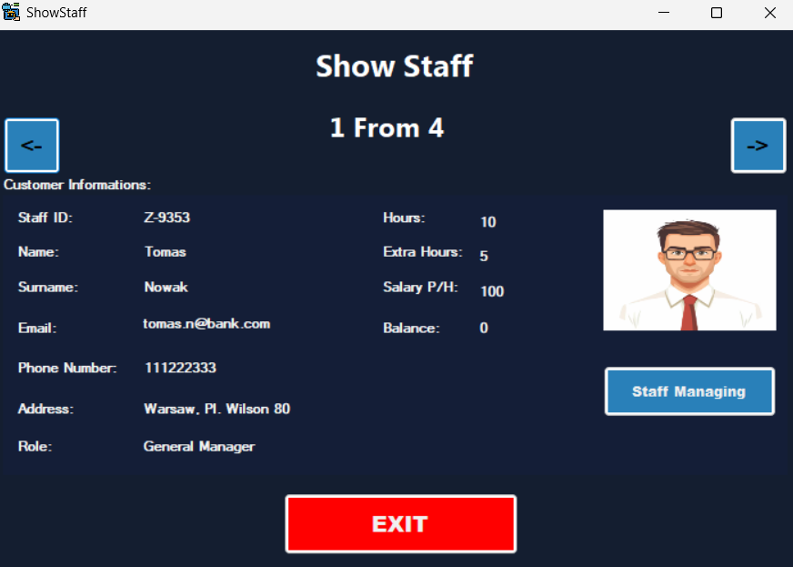
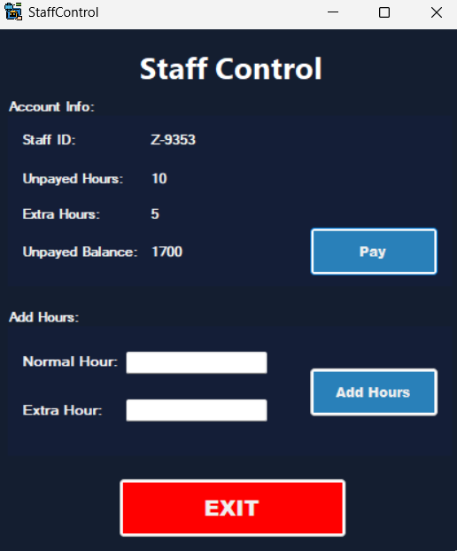

# 🏦 Bank Management System

A Windows Forms application for managing bank customers and staff, built with C# and .NET Framework as a university project for Object-Oriented Programming course.

---

## 📋 Features

### 👥 Customer Management
- ➕ Add new customers with photo upload
- 👁️ View all customers with navigation
- ✏️ Edit customer information
- 💰 Account operations:
  - 📥 Deposit money
  - 📤 Withdraw money
  - 💎 Transfer to savings

### 👔 Staff Management
- ➕ Add new staff members
- 👁️ View all staff
- ⏰ Track working hours (normal & overtime)
- 💵 Calculate and pay salaries automatically
- 🎖️ 4 different roles with different pay rates

---

## 🛠️ Technologies

- **Language:** C# (.NET Framework 4.7.2)
- **UI:** Windows Forms
- **Storage:** Text files (no database)
- **IDE:** Visual Studio 2022

---

## 🎯 OOP Concepts Used

| Concept | Implementation |
|---------|---------------|
| **Inheritance** | `Customers` and `Staff` inherit from abstract `Person` class |
| **Encapsulation** | Private fields with public properties (with validation) |
| **Static Classes & Fields** | Used for data sharing between forms |
| **File Operations** | FileStream, StreamReader, StreamWriter |
| **Exception Handling** | Try-catch blocks throughout the application |

---

## 🆔 ID Generation (Random & Unique)

| Type | Format | Example |
|------|--------|---------|
| **User ID** | `[A-E]-XXXX` | `A-7485` |
| **Account Number** | `5585 XXXX XXXX XXXX` | `5585 4125 6598 3221` |
| **Staff ID** | `[T,L,X,Y,Z]-XXXX` | `T-8598` |

---

## 💼 Staff Roles & Salaries

| Role | PLN/hour | Overtime (+40%) |
|------|----------|-----------------|
| General Manager | 100 | 140 |
| Manager | 70 | 98 |
| Cashier | 50 | 70 |
| Security | 40 | 56 |

> ⚡ Overtime hours are automatically paid 40% more.

---
```
## 📂 Project Structure
NullTeam_Bank_Management/
├── Person.cs              # Abstract base class
├── Customers.cs           # Customer class (inherits Person)
├── Staff.cs               # Staff class (inherits Person)
├── Form1.cs               # Main menu
├── Addcustomers.cs        # Add new customer
├── ShowCustomers.cs       # View customers
├── EditCustomer.cs        # Edit customer info
├── AccountControl.cs      # Withdraw / Deposit / Transfer
├── AddStaff.cs            # Add new staff
├── ShowStaff.cs           # View staff
└── StaffControl.cs        # Add hours / Pay salary
```
---
## 🚀 How to Run

1. Clone the repository:
```bash
   git clone https://github.com/dvdzzy/Bank-Management-System.git
```
2. Open the `.sln` file in Visual Studio
3. Build the solution (**F6**)
4. Run the application (**F5**)

---

## 👥 Team

Programmed by **NullTeam**

---

## 📅 Project Info

- **Course:** Object-Oriented Programming
- **University:** Vistula University
- **Year:** 2026 Spring
- **Project:** Project 2

---
---

## 📸 Screenshots

### Main Menu


### Add Customer


### Show Customer


### Edit Customer


### Account Control


### Add Staff


### Show Staff


### Staff Control


## 📄 License

This project is licensed under the MIT License - see the [LICENSE](LICENSE) file for details.
